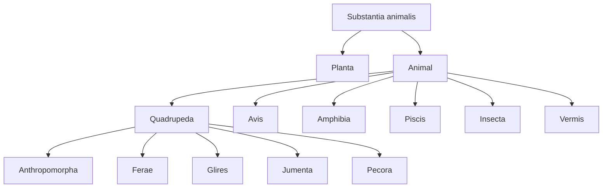
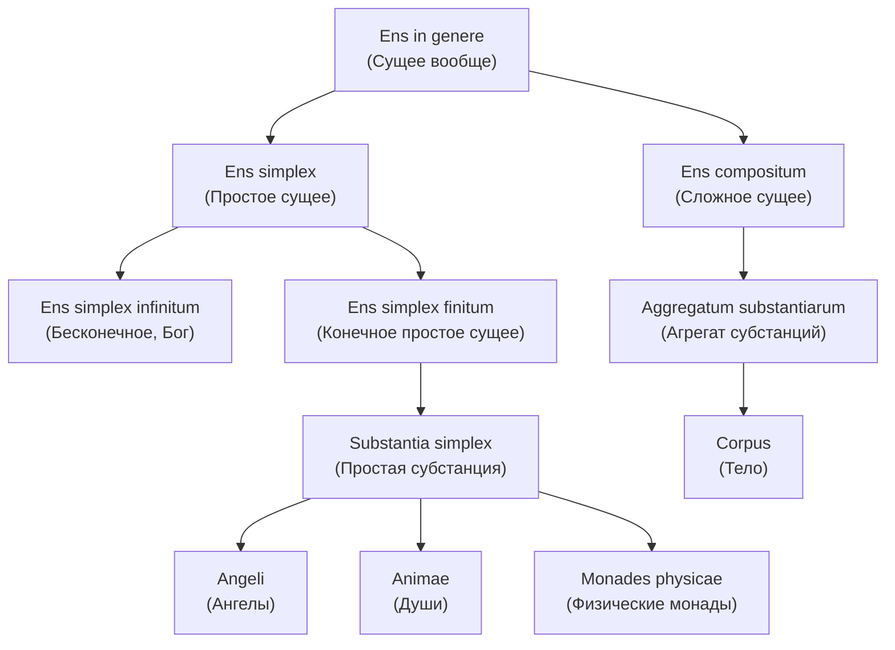
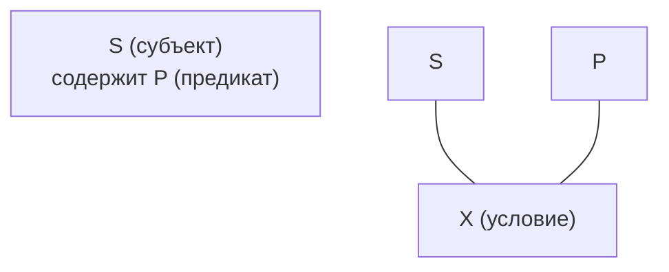
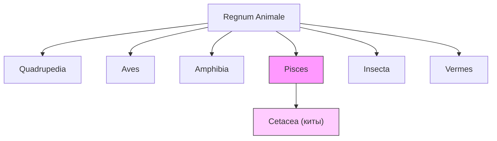
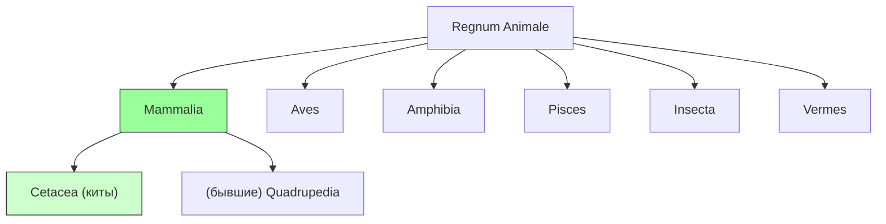

# Кантовская теория суждения 

## Понятие

«понятие есть *общее* (repraesentatio per notas communes) или *рефлективное* представление (repraesentatio discursiva) <...> Говорить о всеобщих или общих понятиях является лишь тавтологией» [Логика, 346]

«понятие имеет отношение к предмету опосредованно, при посредстве признака, который может быть общим для нескольких вещей» (A320/376-377)

### Содержание и объем понятия 

«всякое понятие, как *частичное понятие*, содержится в представлении вещей; *в качестве основы познания*, т.е. *признака*, эти вещи содержатся *под ним*. 
В первом смысле всякое понятие имеет *содержание*, во втором -- *объем*. 
Содержание и объем понятия стоят друг к другу в обратном соотношении. 
Именно чем больше понятие содержит под собой, тем меньше оно содержит в себе и наоборот» [Логика, 351]

«Объем, или сфера, понятия тем больше, чем больше вещей может под ним находиться и в нем мыслиться» [Логика, 351]

### Таксономия понятий 

[Линней, 1735]

## Суждение 

«Суждение есть представление единства сознания различных представлений или представление об их отношении, поскольку они образуют понятие» [Логика, 355]

### Аналитические и синтетические суждения 

«Поэтому необходимо признать, что закон противоречия есть всеобщий и вполне достаточный *принцип всякого аналитического познания*; но далее этого его значение и пригодность как достаточногокритерия истины не простирается. 
Ибо то обстоятельство, что никакое познание не может идти вразрез с ним, не уничтожая себя, делает этот закон, правда, *conditio sive qua non*, но не превращает его в основание для определения истинности нашего познания <...> мы, правда, всегда стараемся не нарушать этого неприкосновенного основоположения, по вопросу об истинности синтетических познаний мы ни в коей мере не можем ожидать от него каких‐либо разъяснений» (A151/B190-191)

«В аналитическом суждении я остаюсь при данном понятии, чтобы что‐либо извлечь из него. 
Если аналитическое суждение должно быть утвердительным, то я приписываю понятию только то, что уже мыслилось в нем; если суждение должно быть отрицательным, то я исключаю из понятия только то, что противоположно ему. 
В синтетических же суждениях я должен выйти за пределы данного понятия, чтобы рассмотреть в отношении с ним нечто совершенно иное, [по сравнению с тем], что мыслилось в нем; это отношение никогда поэтому не может ни отношением тождества, ни отношением противоречия, и из такого суждения самого по себе нельзя усмотреть ни истинности его, ни ошибочности» (A154/B193)

[Линней, 1735]

[Линней, 1758]

## Созерцание

«Чтобы *познать* предмет, требуется, чтобы я мог доказать его возможность (или по свидетельству опыта на основании действительности предмета, или *a priori* с помощью разума). 
Но *мыслить* я могу что угодно, если только я не противоречу самому себе, т.е. если мое понятие есть только возможная мысль, хотя бы я и не мог решить, соответствует ли ей или не соответствует объект в совокупности всех возможностей. 
Но для того, чтобы приписать такому понятию объективную значимость (реальную возможность, так как первая возможность была только логической), требуется нечто большее...» (Bxvi)

«Познание есть или *созерцание*, или *понятие* (*intuitus vel conceptus*). 
Созерцание имеет непосредственное отношение к предмету и всегда бывает единичным, а понятие имеет отношение к предмету опосредованно, при посредстве признака, который может быть общим для нескольких вещей» (A320/376-377)

«Все познания, т.е. все представления, сознательно относимые к объекту, суть или *созерцания*, или *понятия*.
Созерцание есть *единичное* представление (repraesentatio singularis);
понятие есть *общее* (repraesentatio per notas communes) или «рефлективное» представление (repraesentatio discursiva) <...> Говорить о всеобщих или общих понятиях является лишь тавтологией» [Логика, 346]

